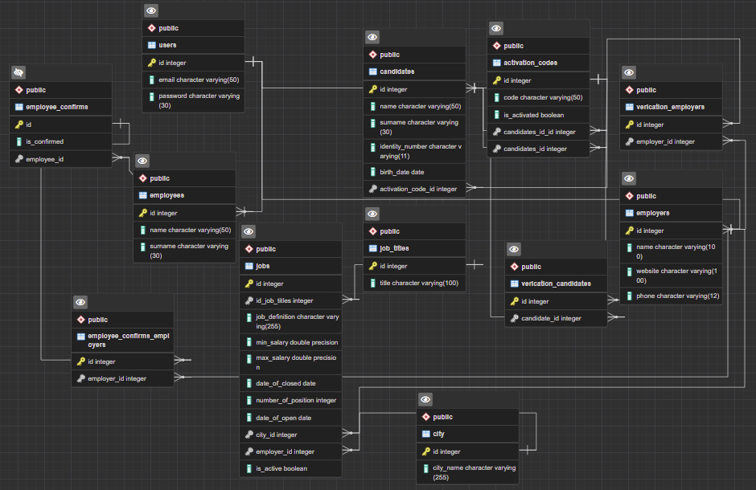

Spring HRMS projesi: 
Sistemde bulunan genel iş pozisyonlarını listeleyen api

**Spring - JavaSE-11  :**
* Dependencies
    * Spring Boot DevTools
    * Spring Web
    * Spring Data JPA
    * PostgreSQL Driver
    * Lombok
    
### PostgreSQL HRMS database:
* users (kullanıcı tipleri)
  * candidates (iş arayanlar/adaylar)
  * employers (işverenler)
  * employees (sistem çalışanları)
  
* job_titles (iş pozisyonları)
    
